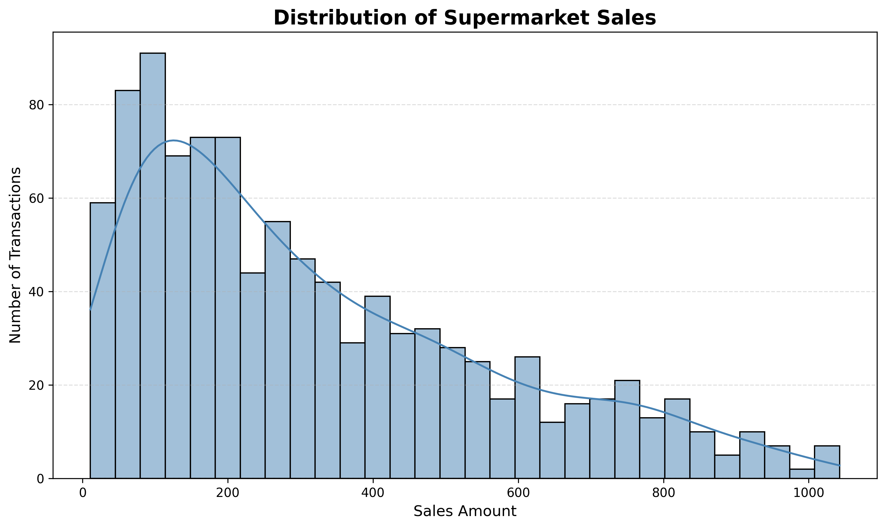
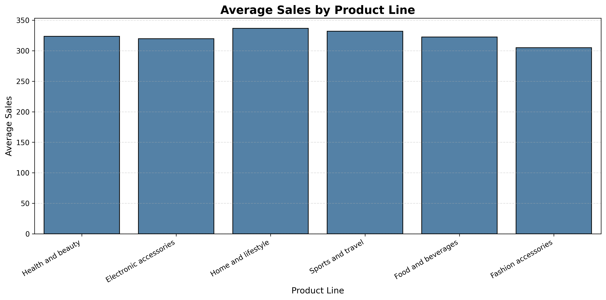
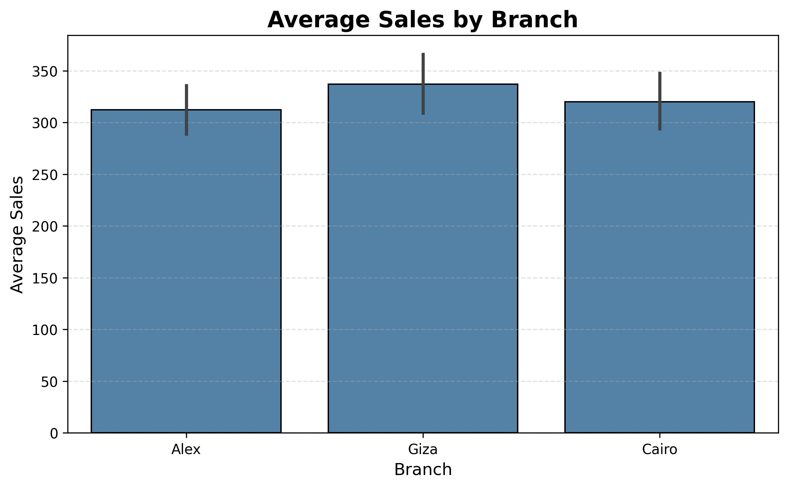
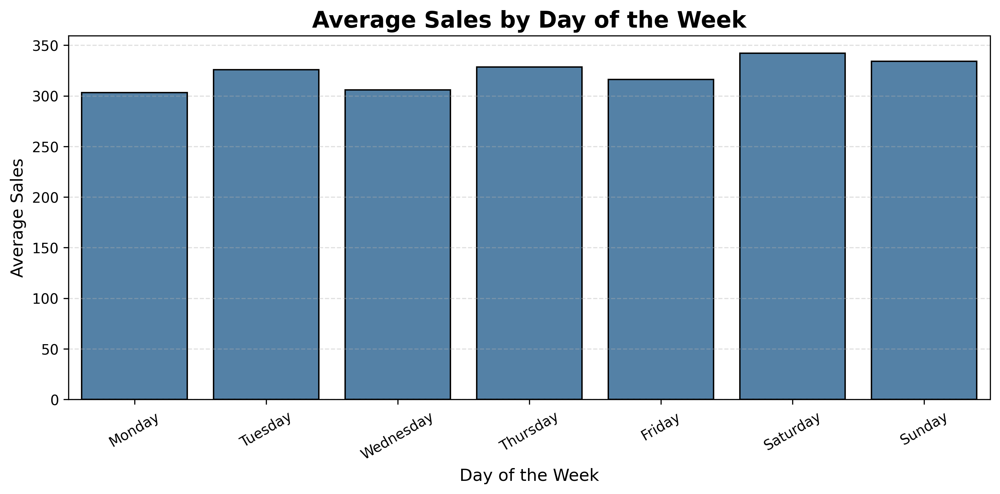
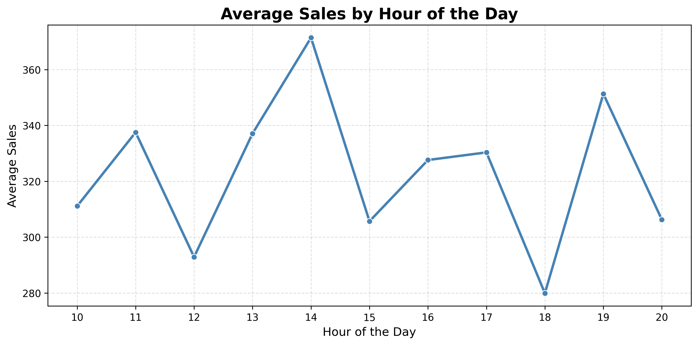
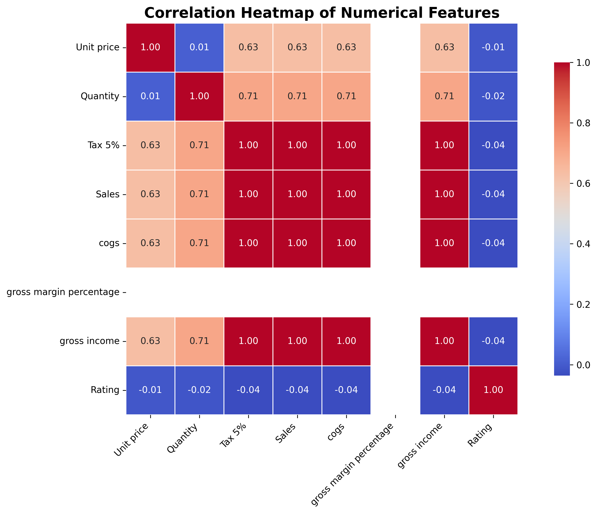

# 🛒 Predictive Modeling of Supermarket Sales Using Machine Learning

An end-to-end machine learning project that predicts supermarket transaction sales using historical sales data. The project demonstrates the complete machine learning workflow—from data preprocessing and exploratory data analysis (EDA) to feature engineering, model development, evaluation, and business insights.

> **Capstone Project** for the Learning Phase of the **DeepTech_Ready Data Science and Machine Learning Internship Program**.

---

## 📸 Project Preview

### Distribution of Supermarket Sales



---

## 🎯 Project Objectives

- Analyze supermarket transaction data to identify factors influencing sales.
- Perform exploratory data analysis (EDA) to uncover meaningful business insights.
- Engineer relevant features for machine learning.
- Train and compare multiple regression models.
- Select the best-performing model using appropriate evaluation metrics.
- Generate actionable insights to support business decision-making.

---

## 🔄 Machine Learning Workflow

```text
Supermarket Sales Dataset
            │
            ▼
Data Cleaning & Preprocessing
            │
            ▼
Exploratory Data Analysis (EDA)
            │
            ▼
Feature Engineering
            │
            ▼
Train-Test Split
            │
            ▼
Model Development
            │
            ▼
Model Evaluation
            │
            ▼
Business Insights
```

---

## 📂 Dataset

**Dataset:** Supermarket Sales Dataset

**Source:** Kaggle

https://www.kaggle.com/datasets/faresashraf1001/supermarket-sales

The dataset contains **1,000 supermarket transactions** with **17 attributes**, including:

- Branch
- City
- Customer Type
- Gender
- Product Line
- Unit Price
- Quantity
- Payment Method
- Date
- Time
- Rating
- Sales *(Target Variable)*

---

## 🛠 Technologies Used

- Python
- Pandas
- NumPy
- Matplotlib
- Seaborn
- Scikit-learn
- Google Colab

---

## 📊 Exploratory Data Analysis

Exploratory Data Analysis (EDA) was performed to understand customer behaviour, purchasing patterns, and factors influencing sales.

### Distribution of Sales


---

### Average Sales by Product Line



---

### Average Sales by Branch



---

### Average Sales by Day of the Week



---

### Average Sales by Hour



---

### Correlation Heatmap



---

## ⚙️ Feature Engineering

The following preprocessing steps were carried out before model training:

- Converted the **Date** column to datetime format.
- Extracted:
  - Year
  - Month
  - Day of Week
  - Hour
- Encoded categorical variables using One-Hot Encoding.
- Split the data into training and testing sets.
- Removed variables that would introduce **data leakage**, including:
  - Tax 5%
  - cogs
  - gross income

---

## 🤖 Machine Learning Models

Four regression algorithms were developed and compared:

- Linear Regression
- Decision Tree Regressor
- Random Forest Regressor
- Gradient Boosting Regressor

---

## 📈 Model Performance

| Model | MAE | RMSE | R² Score |
|:--------------------------|------:|------:|------:|
| Linear Regression | 58.919 | 79.565 | 0.903 |
| Decision Tree Regressor | 8.489 | 13.354 | 0.997 |
| **Random Forest Regressor ⭐** | **6.872** | **10.283** | **0.998** |
| Gradient Boosting Regressor | 7.594 | 10.345 | 0.998 |

---

## 🏆 Best Performing Model

The **Random Forest Regressor** achieved the best predictive performance.

**Performance Metrics**

- **MAE:** 6.872
- **RMSE:** 10.283
- **R² Score:** 0.998

The model produced highly accurate predictions and outperformed the other regression algorithms evaluated during this study.

---

## 💡 Business Insights

Key findings from the analysis include:

- Product lines contribute differently to transaction sales.
- Weekend transactions generally record higher average sales than weekdays.
- Member customers slightly outnumber normal customers.
- E-wallet is the most frequently used payment method.
- Average transaction values vary modestly across branches and cities.
- Machine learning can accurately predict supermarket sales, supporting:
  - Inventory planning
  - Workforce scheduling
  - Business strategy
  - Sales forecasting

---

## 📁 Repository Structure

```text
Predictive-Modeling-of-Supermarket-Sales
│
├── images/
│   ├── distribution_of_sales.png
│   ├── average_sales_by_branch.png
│   ├── average_sales_by_product_line.png
│   ├── average_sales_by_day.png
│   ├── average_sales_by_hour.png
│   └── correlation_heatmap.png
│
├── Supermarket_Sales_Prediction.ipynb
├── requirements.txt
└── README.md
```

---

## 🚀 How to Run the Project

### Clone the repository

```bash
git clone https://github.com/Etim-Antai/Predictive-Modeling-of-Supermarket-Sales.git
```

### Install dependencies

```bash
pip install -r requirements.txt
```

### Open the notebook

Run using Jupyter Notebook

```bash
jupyter notebook
```

or upload the notebook to **Google Colab**.

---

## 📚 Lessons Learned

This project strengthened my practical understanding of:

- Data preprocessing
- Exploratory Data Analysis (EDA)
- Feature engineering
- Regression modelling
- Model evaluation and comparison
- Preventing data leakage
- Translating analytical results into business insights

Beyond building accurate predictive models, this project reinforced the importance of understanding the data, selecting appropriate evaluation metrics, and developing machine learning solutions that create real business value.

---

## 🚀 Future Improvements

Possible enhancements include:

- Hyperparameter tuning using GridSearchCV.
- K-Fold Cross Validation.
- Feature importance analysis using SHAP values.
- Model deployment with Streamlit or Flask.
- Model tracking using MLflow.
- Deployment on Azure Machine Learning.

---

## 👨‍💻 Author

### **Etim Antai**

Electrical & Electronic Engineer | Data Analyst | Machine Learning Enthusiast

**LinkedIn**

https://www.linkedin.com/in/etim-antai-a59328198/

**GitHub**

https://github.com/Etim-Antai

---

## 🙏 Acknowledgements

This project was completed as the capstone project for the learning phase of the **DeepTech_Ready Data Science and Machine Learning Internship Program**, delivered in collaboration with:

- DeepTech_Ready
- 3MTT Nigeria
- Microsoft
- Data Science Nigeria (DSN)
- 8thGear® Hub & Venture Studio

---

⭐ If you found this project interesting, consider giving it a **star** and feel free to connect with me on LinkedIn.
